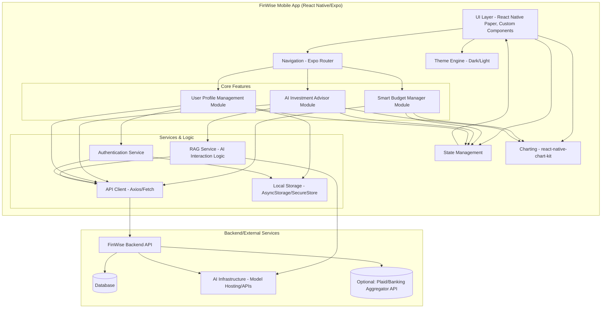
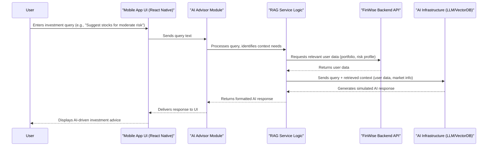
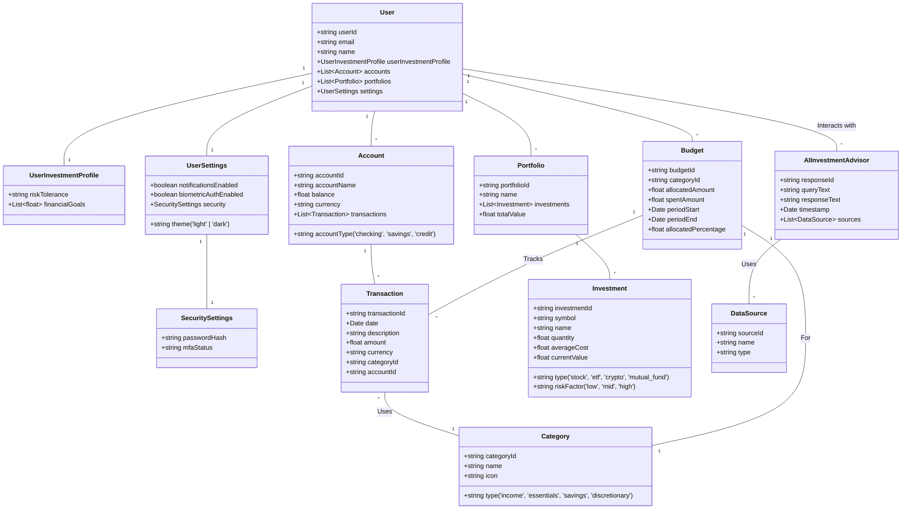
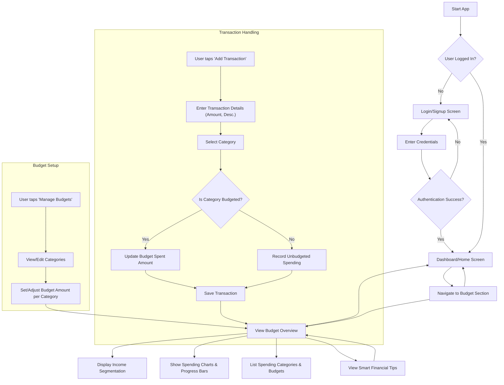

# BudgetCopilot Application Documentation

## Pitch Deck
Startup Pitch [Slides](https://docs.google.com/presentation/d/1PtY-5ouJg_3388W7oEIh_2JwJeI5bbBYX6qiRKD1-iY/edit?usp=sharing)

## Project Overview
**BudgetCopilot** is a modern fintech mobile application developed using React Native and Expo. It serves as a **Automated Smart Budget Manager** specifically designed for millennials and retail investors. The application aims to simplify personal finance management, demystify investing, and provide actionable insights through an intuitive interface and intelligent features.
**Target Audience:** Users with Low Financial Management & Investors: Addresses their specific pain points with a modern, intuitive interface.

**Core Problems Addressed:**
1. Lack of effective personal financial management habits.
2. Limited knowledge and accessibility of alternative investment channels.
3. Uncertainty faced by retail investors regarding optimal investment opportunities and portfolio tracking.
4. Difficulty in obtaining clear, consolidated financial overviews, even for banked customers.

**Technical Stack:**
- **Frontend:** React Native with Expo Router
- **Language:** TypeScript
- **UI Library:** React Native Paper
- **Charting:** react-native-chart-kit
- **Theming:** Dark/Light mode support
- **Security**: MFA and biometric authentication

## 1. UML Diagram

## 1. UML Diagrams

### 1.1. Component Diagram

This diagram illustrates the high-level architecture and dependencies between major components of the FinWise application.

### 1.2. Sequence Diagram: AI Advisor Interaction Flow

This diagram shows the sequence of interactions when a user queries the AI Investment Advisor.

### 1.3. Class/Interface Diagram: Data Model

This diagram outlines the core data structures used within the application. (Simplified representation).

### 1.4. User Flow Diagram: Budget Management Process

This diagram illustrates the typical user journey within the Smart Budget Manager feature.

### 1.5 Usecase Diagram

## 2. Application Manual
### 2.1. Feature Guides
#### 2.1.1. Automated Smart Budget Manager

- **Overview:** Access the 'Budget' tab from the main navigation. The overview screen automatically shows:

    - Your total income segmented based on predefined or customized Buckets and percentages.
    - Visualizations of your spending against set budgets for different Buckets (categories).
- **Tracking Spending:**
    
    - Transactions can be added manually via the '+' button or automatically linked via bank connection (Premium Feature).

    - Categorize each transaction (e.g., Food, Rent, Utilities). The app learns your habits over time.

- **Setting Budgets:**
    
    - Navigate to 'Manage Budgets' within the Budget section.

    - Select a category (e.g., 'Dining Out').

    - Set a percentage/monthly spending limit. Progress bars will track your spending against this limit.

- **Smart Tips:**
    
    - The app analyzes your spending patterns.

    - Periodically, relevant tips appear on the budget overview or via notifications (e.g., "You've spent 80% of your 'Entertainment' budget with 10 days left in the month.").

#### **2.1.2. Portfolio Manager**

- **Overview:** Access the 'Portfolio' tab from the main navigation. The main screen provides a consolidated view of your investments:
    
    - **Total Portfolio Value:** Displayed prominently, showing the current market value of all your tracked investments.

    - **Overall Performance:** View your total gain/loss (both absolute value and percentage) since inception or over selected time periods (e.g., 1D, 1W, 1M, YTD, All).

    - **Allocation Chart:** A visual breakdown (e.g., pie chart using react-native-chart-kit) showing how your portfolio is distributed across different asset types (stocks, ETFs, crypto, etc.) or sectors.

- **Tracking Investments:**
    
    - A list displays all your added investments, showing key details for each: Name/Symbol, Quantity, Average Cost, Current Value, Daily Change, Total Gain/Loss.

    - Tap on an individual investment to see a detailed view, including historical performance charts and specific transaction history (buys/sells) for that asset.
    - Manually add new investments using the '+' button, specifying the asset type, symbol/name, quantity, and purchase price/average cost.

- **Risk Analysis:**
    
    - Navigate to the 'Analysis' sub-section within the Portfolio tab.
    - The app calculates an **Overall Portfolio Risk Score** based on the risk factors ('low', 'mid', 'high') assigned to each investment type and its weighting in your portfolio.
    - View a breakdown of your portfolio by risk level.
    - Compare your portfolio's risk profile against your **User Investment Profile** (Risk Tolerance setting). The app may provide insights if there's a significant mismatch.

- **Market Investment Options Analysis (Premium Feature):**
    
    - Access the 'Discover' or 'Market Watch' sub-section.
    - Explore potential investment opportunities based on market data.
    - Filter and search for stocks, ETFs, cryptocurrencies, etc., based on criteria like sector, risk level, performance, or analyst ratings.

#### 2.1.3. User Profile Management

- **Access:** Tap the 'Profile' icon in the navigation.
    
- **Account Information:** View and edit your name, email. Option to link/unlink accounts.
    
- **Preferences:**
    
    - **Notifications:** Toggle on/off different types of alerts (budget warnings, market news, tips).

    - **Biometric Auth:** Enable fingerprint or face recognition for login (if supported by device).

    - **Theme:** Switch between Dark and Light mode.

- **Security:** Change password, manage multi-factor authentication (MFA) settings.
    

### 2.3. Settings Configuration

- **Theme:** Profile > Preferences > Theme > Select 'Light' or 'Dark'.
    
- **Notifications:** Profile > Preferences > Notifications > Toggle desired alerts.
    
- **Biometric Login:** Profile > Preferences > Biometric Authentication > Enable/Disable. Requires initial device setup.
    
- **Budget Categories:** Budget > Manage Budgets > Add/Edit/Delete categories and set spending limits.
    
- **Portfolio Profile:** Profile > Investment Profile > Update Risk Tolerance and Financial Goals for tailored advice and risk analysis.
    

## 3. Business Case

### 3.1. Market Analysis

- **Target Market:** Users with Low Financial Management & Investors, Millennials (approx. ages 28-43) and Gen Z retail investors represent a large, tech-savvy demographic increasingly focused on financial wellness but **often lacking formal financial education**.
- **Problem Validation:** Studies show Low Financial Management & Investors, millennials struggle with budgeting, debt management, and investment confidence. They seek intuitive, mobile-first solutions. The rise of retail investing platforms indicates strong interest, but often without adequate guidance.
- **Market Size:** The global fintech market is vast and growing, with significant segments in personal finance management (PFM) and digital investment platforms. There's a specific niche for apps combining both educationally.
- **Competition:** No real Competition in the Egyptian market.

### 3.2. Revenue Models

1. **Freemium Model:**
    
    - **Free Tier:** Basic budget tracking, manual transaction entry, limited spending categories (3 Buckets only), manual portfolio entry & basic tracking.

    - **Premium Tier (Subscription - e.g., "BudgetCopilot Pro")** Includes:

    - Automated income segmentation.
    - Unlimited custom budget buckets (categories).
    - Detailed portfolio performance tracking & projections.
    - Secure bank account linking (potential via Plaid or similar).
    - Market investment options tracking and analysis.
    - Advanced risk analysis features.
    
2. **Partnership Opportunities:**
    
    - Affiliate partnerships with brokers or financial product providers (clearly disclosed).
        
    - Offer financial literacy content and investment options partnerships.
        

### 3.3. User Acquisition Strategy

- **Digital Marketing:** Targeted ads on social media (Instagram, TikTok, LinkedIn), search engines (Google Ads).
- **Content Marketing:** Blog posts, articles, social media content on personal finance, budgeting tips, basic investment concepts relevant to millennials.
- **App Store Optimization (ASO):** Optimize app store listing (keywords, description, screenshots) for visibility.
- **Referral Program:** Incentivize existing users to refer friends (e.g., one month free Pro).
- **Influencer Marketing:** Collaborate with finance influencers popular among the target demographic.
- **PR & Community Building:** Engage in relevant online communities (Reddit forums like r/personalfinance), seek press coverage in tech/finance media.

### 3.4. Cost Structure

- **Development Costs:** Initial build (React Native, Expo, Backend), ongoing feature development, bug fixing.
- **Maintenance Costs:** Server hosting (AWS/GCP/Azure), database management, API usage (e.g., market data APIs, potential bank linking APIs like Plaid).
- **Marketing & Sales Costs:** Advertising spend, content creation, potential sales staff for B2B partnerships.
- **Operational Costs:** Staff salaries (devs, designers, product, marketing, support), legal & compliance, office space.

### 3.5. Break-Even Analysis and Projected ROI

- **Assumptions:** Requires modeling based on estimated user acquisition cost (CAC), conversion rate from free to premium, average revenue per user (ARPU), and churn rate.
- **Break-Even Point:** Target achieving break-even within 2-4 years of launch, contingent on achieving user growth milestones and premium conversion targets (e.g., 5-10% conversion rate).
- **Projected ROI:** Long-term ROI depends heavily on scalability, user retention, and potential expansion. A successful app in this space can achieve significant ROI, but initial investment is substantial. Projections should show ROI > 1 within a 5-7 year horizon under optimistic scenarios.

### 3.6. Potential Expansion Opportunities

- **Feature Expansion:** Advanced investment tools (options tracking, detailed crypto analysis), debt management tools, goal-based savings plans, gamification.
- **Integration Expansion:** Deeper integration with more financial institutions (via Open Banking APIs), insurance providers, mortgage lenders.
- **Platform Expansion:** Web-based version of the application.
- **Geographical Expansion:** Target markets outside the initial launch country, adapting to local regulations and financial products.
- **B2B Offerings:** White-labeling the platform or specific modules for financial institutions or employee benefit programs.

## 4. SWOT Analysis

- **Strengths:**
    - **Automated Budgeting:** Simplifies a key pain point for users.
    - **User-Friendly Interface:** Built with React Native Paper for a clean, modern look and feel on both iOS and Android. Dark/Light theme enhances usability.
    - **Integrated Solution:** Combines budgeting and investment tracking/analysis in one app.
    - **Cross-Platform:** React Native/Expo allows for faster development and deployment across iOS and Android.
    - **Targeted Niche:** Focuses specifically on the needs of less experienced users and retail investors.
- **Weaknesses:**
    - **Bank Integration Complexity:** Achieving reliable and secure bank linking across many institutions can be challenging and costly (relies on third-party APIs or Open Banking). Initial manual entry might be a friction point.
    - **Market Data Costs/Latency:** Real-time or near-real-time market data APIs can be expensive.
    - **Brand Trust:** As a new entrant, building trust, especially regarding financial data and investment advice (even if automated), is crucial and takes time.
    - **Dependence on Third-Party APIs:** Reliance on external APIs for market data or bank linking creates external dependencies.
- **Opportunities:**
    - **Market Growth:** Increasing demand for financial literacy tools and digital PFM solutions among younger generations.
    - **Open Banking Trends:** Regulations promoting data sharing (if leveraged via APIs like Plaid) can enable richer features like automated transaction import and portfolio syncing.
    - **Partnerships:** Collaborations with financial institutions, educational platforms, or employers for distribution.
    - **Content & Education:** Becoming a trusted source of financial knowledge beyond the app features.
- **Threats:**
    - **Intense Competition:** Established fintechs (PFM apps, robo-advisors) and incumbent banks improving their digital offerings.
    - **Regulatory Changes:** Evolving regulations in finance, data privacy (GDPR, CCPA), and investment advice could increase compliance costs or limit features.
    - **Data Privacy & Security Breaches:** A single security incident can severely damage reputation and user trust. Robust security (MFA, biometrics, encryption) is essential but requires constant vigilance.
    - **Economic Downturns:** Reduced disposable income and investment appetite among target users could impact premium subscription uptake.

## Addressing Key Problem Statements

BudgetCopilot directly addresses the identified problems:

1. **Users' lack of personal financial management:** The **Automatic Smart Budget Manager** provides automated income segmentation, clear spending visualizations (charts, progress bars), customizable budget tracking, and proactive financial tips based on user behavior, fostering better financial habits.
2. **Limited knowledge of alternative investment channels & tracking:** The **Portfolio Manager** allows users to track various investment types (stocks, ETFs, crypto, etc.), view performance clearly, understand asset allocation, and access **Risk Analysis**. The **Market Investment Options Analysis** (Premium) helps users discover and evaluate potential investments in an accessible format.
3. **Uncertainty for retail investors:** The **Portfolio Manager** provides clear performance tracking, risk assessment relative to user profiles, and (in Premium) market analysis tools reducing uncertainty and empowering decision-making.
4. **Complex financial overviews for banked customers:** BudgetCopilot provides a **unified and simplified dashboard**. It combines budgeting insights (spending breakdowns by bucket, budget adherence) and investment portfolio views (value, performance, allocation, risk) with clear visualizations (react-native-chart-kit), offering a holistic financial picture that is **often clearer and more consolidated than traditional bank statements or disparate apps**.
